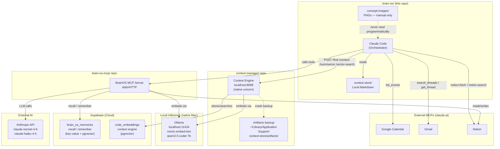
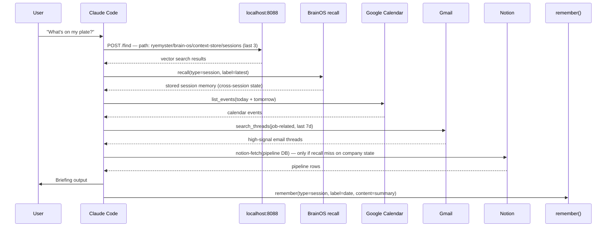
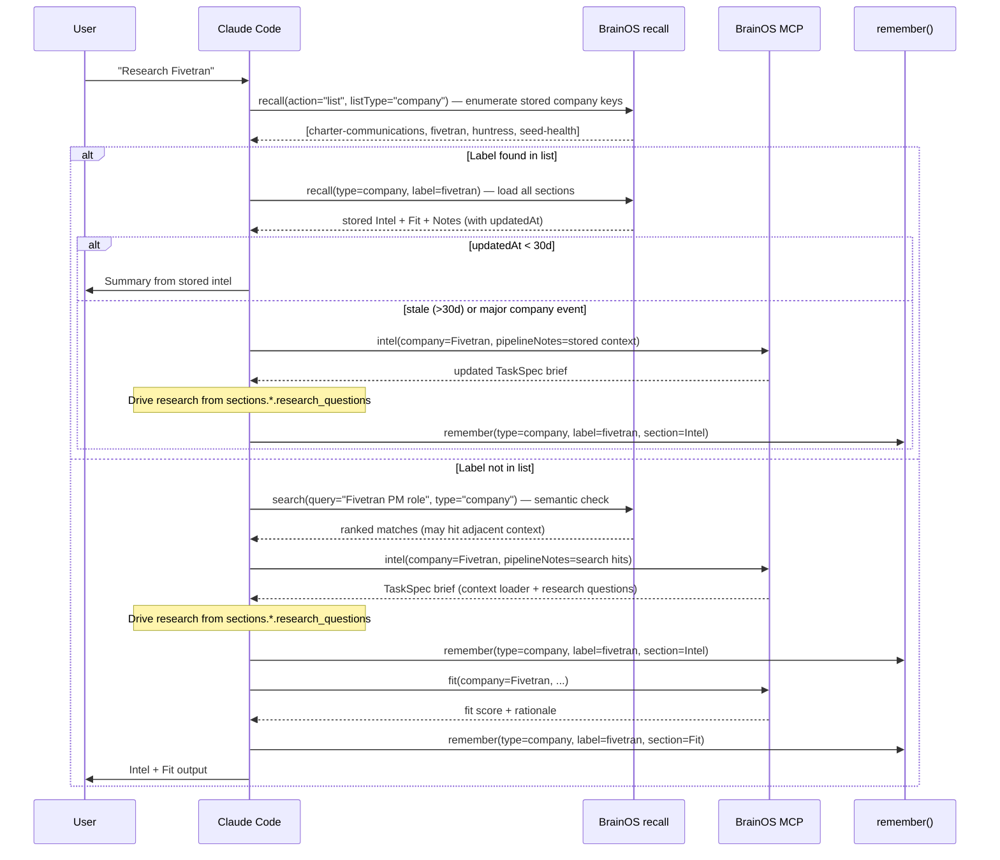
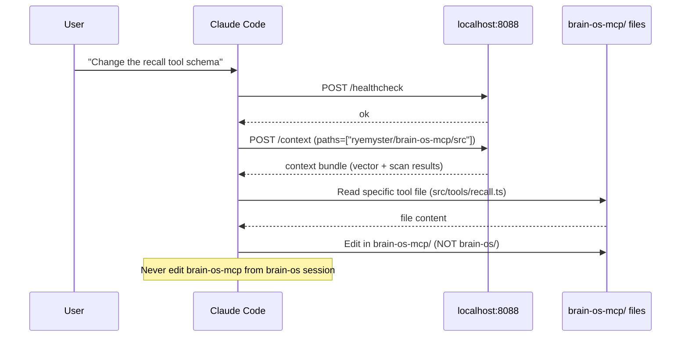
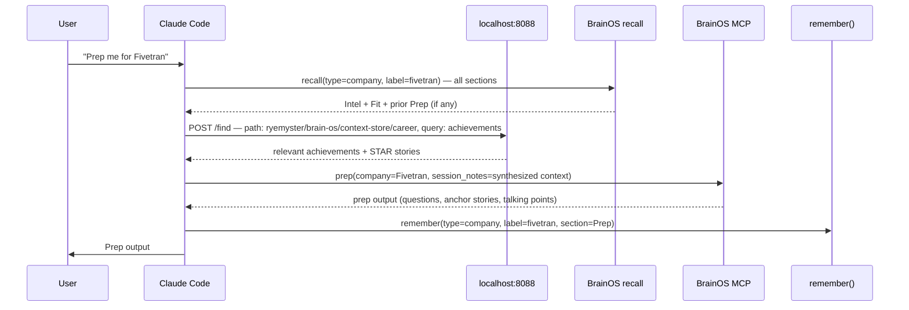

# BrainOS Architecture

System topology and orchestration flows. Use this before designing new workflows or adding context layers.

---

## Topology

---

## Key Distinctions

| | Context Engine (8088) | BrainOS recall | BrainOS search |
|-|-----------------------|---------------|----------------|
| **Type** | File/code scanner | Key-value lookup | pgvector similarity |
| **Index** | `code_embeddings` | `brain_os_memories` | `brain_os_memories` |
| **Query** | Path + natural language | `type + label + section` | Embedding similarity |
| **Output** | Embedded into `code_embeddings` pgvector; crash backup to `~/Library/Application Support/context-store/artifacts/` | Stored markdown content | Ranked memory chunks with score + `updatedAt` |
| **Exposed as tool?** | Yes — via HTTP endpoints | Yes — `recall` tool (also `recall(action="list")` to enumerate labels) | ✅ Yes — `search` tool |
| **Best for** | File search, code analysis, local markdown scan | Exact known entries (company, story, insight) | "Find anything related to X" — discovery before recall |

---

## Sequence Diagrams

### Flow A — Daily Brief / "What's on my plate"

---

### Flow B — Company Research (intel → fit)

---

### Flow C — Code / MCP Dev Task

---

### Flow D — Interview Prep

---

## Freshness Reference

| Data Type | Primary Source | Hit External When | Staleness Rule |
|-----------|---------------|-------------------|----------------|
| Calendar events | Google Calendar MCP | **Always** — never cache | Live only |
| Gmail | Gmail MCP | **Always** — filter last 7–14d | Live only |
| Notion pipeline | `recall(type=company)` → Notion | recall miss OR feels stale | Re-query if >7d since last `remember` |
| Company intel | `recall(type=company, section=Intel)` | recall miss OR major company event | Re-run `intel()` if >30d old |
| Session history | `context-store/sessions/` (local) | Never — always local | Read last 3 sessions; recall for older |
| Career docs | `context-store/career/` (local) | Never — always local | Stable; manual edits only |
| Code context | localhost:8088 `/context` or `/find` | On task start for code tasks | Re-scan if files changed since last scan |
| Stories / STAR | `recall(type=story)` | Never — always in recall | Updated manually via `remember` |
| Patterns / insights | `recall(type=insight)` | Never — always in recall | Updated via `diagnose` tool |

---

## concept-images/

Three PNGs — private visual reference only. No programmatic pipeline. Never read, quoted, passed to tools, or embedded in outputs. Purely for manual inspiration when designing UX or positioning.

---

## What's Not Yet Built

| Gap | Impact | Priority |
|-----|--------|----------|
| concept-images/ has no pipeline | Images unused by any tool or workflow | Low (by design) |

## Recently Fixed

| Gap | Fix |
|-----|-----|
| localhost:8088 not wired into daily brief flow | ✅ `/daily` skill now calls context engine in step 0 |
| Sub-agents had no context engine guidance | ✅ `agents/README.md` now has Context Engine section with path prefix |
| Skills used bare `context-store/` path | ✅ All skills updated to `ryemyster/brain-os/context-store` |
| No `/setup` reference in any doc | ✅ `CLAUDE.md`, `brainos-context-contract.md`, `project-map.md` all reference it |
| PostToolUse/Stop hooks not configured | ✅ `session-write.sh` (Stop), persist reminders (PostToolUse) — active in `settings.json` |
| `searchMemory()` not exposed | ✅ `search` MCP tool live — semantic discovery across `brain_os_memories` |
| `recall` returns `updated_at` in prose only | ✅ `recall` now returns `{ content, updatedAt, label, type }` — machine-readable |
| No label discovery for cold-start | ✅ `recall(action="list", listType="company")` enumerates stored labels |
| `intel.ts` doc said LLM-driven | ✅ JSDoc + mcp-map.md corrected: intel() is a brief generator; orchestrator drives research |

## Recently Fixed (2026-05-24)

| Gap | Fix |
|-----|-----|
| `searchMemory()` not exposed | ✅ `search` MCP tool live — semantic discovery across `brain_os_memories` |
| `recall` returns `updated_at` in prose only | ✅ `recall` now returns `{ content, updatedAt, label, type }` — machine-readable |
| No label discovery for cold-start | ✅ `recall(action="list", listType="company")` enumerates stored labels |
| `intel.ts` doc said LLM-driven | ✅ JSDoc + mcp-map.md corrected: intel() is a brief generator; orchestrator drives research |
