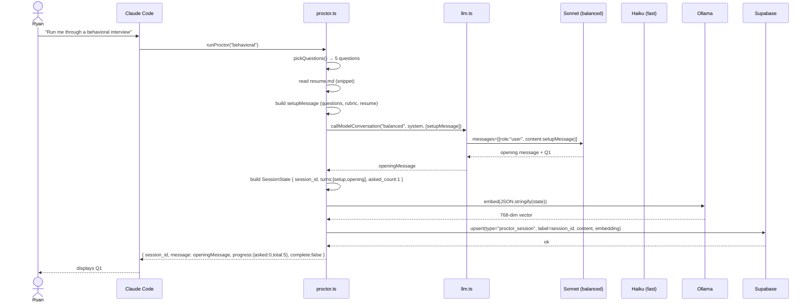
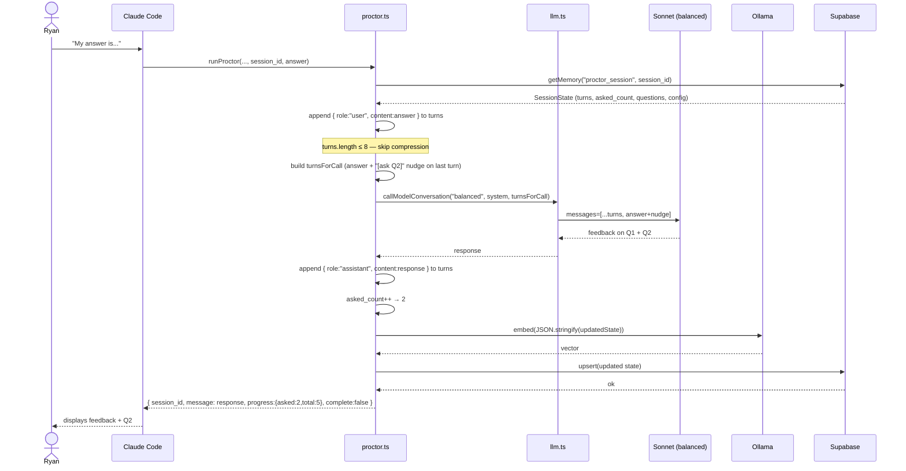
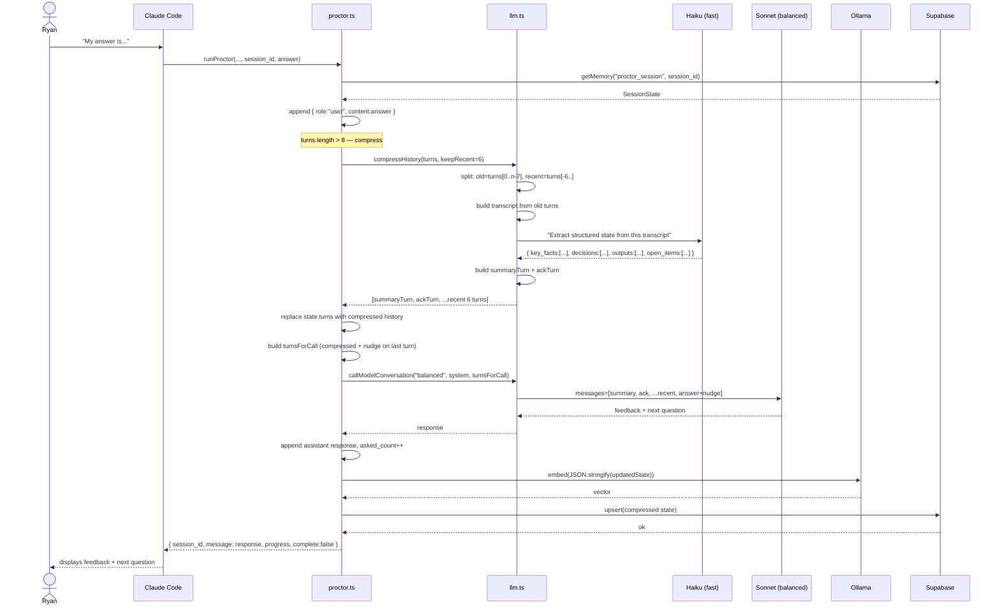
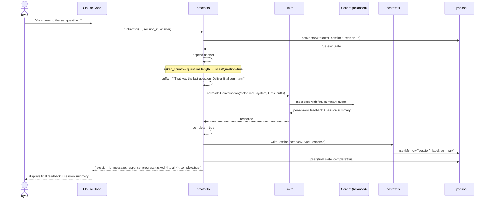

# Proctor Session Flow

The `proctor` tool is the only stateful tool in BrainOS. Every other tool is a single-shot call. Proctor runs a multi-turn mock interview loop — question → answer → feedback → next question — across as many calls as the session has questions.

This document explains how session state is managed, how conversation history is kept bounded, and where rolling summarization fires.

---

## Key design choices

| Choice | Reason |
|--------|--------|
| State lives in Supabase, not the caller | MCP tools are stateless. The caller (Claude Code) only needs to pass `session_id` — it doesn't carry the history. |
| Rolling summarization via Haiku | Long sessions would overflow Sonnet's context. Haiku compresses old turns cheaply, preserving structure without blowing cost. |
| Structured JSON summary (not prose) | Sonnet reasons more reliably over `{ key_facts, decisions, outputs, open_items }` than over a paragraph summary. |
| Nudge suffix stripped before saving | The `[ask next question: "..."]` hint sent to Sonnet is a model hint only — it never enters the canonical history. |

---

## Sequence: New Session



---

## Sequence: Answer Pass (no compression)

Turns are below the compression threshold (≤ 8). History is sent as-is.



---

## Sequence: Answer Pass (with rolling summarization)

Fires when `turns.length > 8` — typically after the 4th or 5th exchange in a longer session.



---

## Sequence: Final Answer

Same as a regular answer pass, but `asked_count >= questions.length` triggers the final summary path.



---

## State shape

Each Supabase row stores the full `SessionState` as a JSON string:

```typescript
interface SessionState {
  session_id: string;
  config: { type, difficulty, company, role };
  questions: Array<{ type, text, rubric[] }>;
  asked_count: number;   // questions asked so far
  turns: ConversationTurn[];  // compressed history
  complete: boolean;
}
```

**Note on embedding:** Every `saveSession` call embeds the full JSON via Ollama. For proctor sessions, the vector is never used — retrieval is always by exact `session_id`. This is a known inefficiency inherited from routing everything through `upsertMemory`. A future `insertRaw` path in `memory.ts` would skip the embed step for session-keyed lookups.

---

## Compression budget

| Metric | Value |
|--------|-------|
| Compression threshold | `turns.length > 8` (4 exchanges) |
| Turns kept verbatim | 6 (last 3 exchanges) |
| Model used to compress | Haiku (`claude-haiku-4-5-20251001`) |
| Max tokens for summary | 1024 |
| Output format | Structured JSON |
