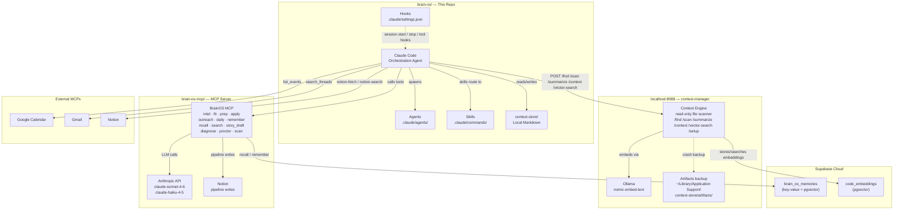

# BrainOS — Agent Brain Architecture

This is the high-level architecture of Ryan's personal agent brain. For detailed sequence diagrams and freshness rules, see `.claude/ARCHITECTURE.md`.

---

## What This Is

BrainOS is a personal AI orchestration system. It combines a local context layer, an LLM orchestrator, domain-specific tools, and external services into a coherent agent that handles job search, writing, research, and daily life.

The system is built on three principles:
1. **Cheap mechanical work stays local** — the context engine (localhost:8088) handles all scanning and searching so Claude's token budget is spent on judgment
2. **Memory is layered** — local files → Supabase key-value → pgvector semantic search → live external APIs
3. **Agent roles are separated** — orchestration (Claude Code), scanning (context engine), tool execution (brain-os-mcp)

---

## System Topology



---

## Roles

| Component | Role | Does NOT |
|-----------|------|----------|
| **Claude Code (Orchestration Agent)** | Judgment, planning, editing, routing | Execute LLM tool calls directly |
| **Context Engine (localhost:8088)** | Scan, search, summarize local files | Write to the repo; answer questions |
| **Sub-agents (Explore, Plan, etc.)** | Targeted read-only exploration via context engine | Make edits or call live services |
| **brain-os-mcp (MCP Server)** | Execute domain tools (intel, fit, prep, etc.) | Read this repo's files directly |
| **Hooks** | Auto-run session start/stop behavior | Replace skill invocation |

---

## Skills (Slash Commands)

| Skill | Use When |
|-------|----------|
| `/job-search` | Any job-hunt task — routes to the right tool (scan → intel → fit → prep → apply → outreach → diagnose) |
| `/prep-loop <company>` | Quick intel → fit → prep sequence for a named company |
| `/daily` | Morning briefing — surfaces calendar, email, pipeline, and open threads |
| `/sync-context` | End-of-session summary and persistence to Supabase + local |
| `/doc-coauthoring` | Structured collaborative document workflow |

---

## Token Optimization Hierarchy

Every agent and skill should move right only when the cheaper option didn't answer the question:

```
/vector-search → /find → /summarize → /context → recall → search → external APIs
```

- **Vector first**: use `/vector-search` to retrieve previously indexed context before re-scanning
- **Narrowest endpoint**: use `/find` for discovery; `/context` only for full multi-path bundles
- **Concise MCP inputs**: extract only the relevant section from context engine output before passing to tools
- **`/setup` once per session**: it's an orientation document, not a per-call lookup

---

## Memory Layers

| Layer | Where | Best For |
|-------|-------|----------|
| `context-store/artifacts/` | Local, crash-recovery | Context engine backup — primary is pgvector |
| `context-store/` markdown | Local, durable | Career docs, writing, projects, session notes |
| `brain_os_memories` (Supabase) | Cloud, persistent | Company intel, stories, insights, session summaries |
| `code_embeddings` (Supabase) | Cloud, persistent | Semantic code/file search via context engine |
| External MCPs | Live | Calendar events, email threads, Notion pipeline rows |

---

## Path Convention (Context Engine)

All `path` parameters to localhost:8088 must be scoped:

| Repo | Path prefix |
|------|-------------|
| This repo (brain-os) | `ryemyster/brain-os/` |
| MCP server | `ryemyster/brain-os-mcp/` |

Never use a bare `"."` — it scans all of `~/Repos`.

---

*Detailed sequence diagrams and freshness rules: `.claude/ARCHITECTURE.md`*
*Context engine integration protocol: `GET http://localhost:8088/setup`*
*This file lives at `docs/ARCHITECTURE.md`*
